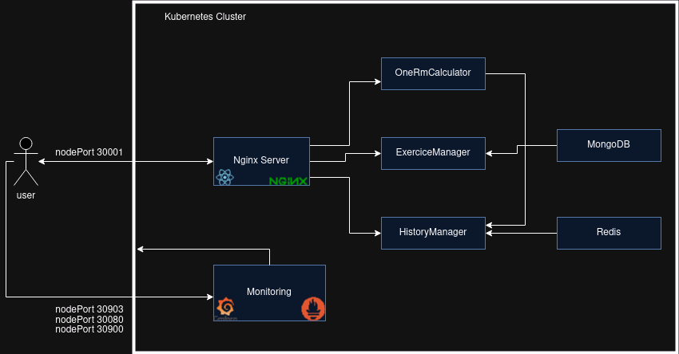

# Gym App Project
<hr>

## Overview
This project offers a comprehensive deployment solution for a simple gym related application. It supports both local and cloud-based environments, ensuring flexibility and scalability for various development and production needs.

For local deployment, the project leverages Docker Compose to quickly set up and run the application in isolated containers, simplifying the process of managing dependencies and configurations. This allows for easy testing and development on a local machine without the need for complex setups.

For cloud deployment, the project integrates with Google Cloud Platform (GCP), using powerful tools like Vagrant, Terraform, Ansible, and Kubernetes to automate infrastructure provisioning, configuration management, and container orchestration. This cloud setup enables users to deploy the application on a scalable Kubernetes cluster, ensuring high availability, fault tolerance, and the ability to handle large volumes of traffic. With Ansible automating the configuration of nodes and Kubernetes managing the containerized application, the project provides a robust cloud solution that can be easily customized and scaled to meet growing demands.

By supporting both local and cloud environments, this project is ideal for development, testing, and production stages, offering a flexible deployment strategy.


<hr>

## Installation

1. **Clone the repository:**
   Using SSH:
   ```bash
   $ git clone git@gitlab.rnl.tecnico.ulisboa.pt:agisit/agisit24-g27.git
   ```
    or

    Using HTTPS:
   ```bash
    $ git clone https://gitlab.rnl.tecnico.ulisboa.pt/agisit/agisit24-g27.git
    ```
<br>
<br>

2. **Local Deployment (Docker Compose):**

    1. Navigate to the local deployment folder:

       ```bash
        $ cd localDeployment
        ```

    2. Build and start the application:

       ```bash
        $ docker-compose up --build
        ```
<br>
<br>

3. **Google Cloud Deployment (Terrafrom, Ansible, Vagrant, Kubernetes):**

    1. Navigate to the Google Cloud deployment folder:

       ```bash
        $ cd cloud/gcpcloud
        ```

    2. Start the Vagrant environment:

        ```bash
        $ vagrant up
        ```
    3. While the previous command runs, modify the following files:

        1. Update terraform-gcp-variables.tf with your Google Cloud project ID.

        2. Create a service account key in the Google Cloud Console, download the .json key file, and move it to the gcpcloud folder.

        3. Update terraform-gcp-provider.tf with the path to your .json key file.

        4. (Optional) If you want to use custom images, edit ansible-start-deployment.yml to update the docker_username variable, but note that you will have to buil those images by running the "build_push_images.sh" script that is located inside the "k8s" folder.

    4. SSH into the management VM and change directory to the Google Cloud project folder:

        ```bash
        $ vagrant ssh mgmt
        $ cd project/cloud/gcpcloud
        ```
    5. Authenticate with Google Cloud:

        ```bash
        $ gcloud auth login
        ```
    6. Initialize Terraform:

        ```bash
        $ terraform init
        ```
    7. Generate SSH keys:

        ```bash
        $ ssh-keygen -t rsa -b 2048
        ```
    8. Plan and apply Terraform deployment:

        ```bash
        $ terraform plan
        $ terraform apply
        ```

    9. Use the Terraform output to update the gcphosts and /etc/hosts files:

        If necessary you can get the ips again by running:
        ```bash
        $ terraform output
        ```

    10. To configure the nodes with Ansible run:

        ```bash
        $ ansible-playbook ansible-gcp-configure-nodes.yml
        ```
    11. Install Kubernetes on the nodes:
        1. Run the playbook:
        ```bash
        $ ansible-playbook ansible-k8s-install.yml
        ```
        2. SSH into the master node ( to do this you have to go to Google Cloud > Compute Engine > VM instances > master > SSH > view gcloud command and copy the command) and verify Kubernetes installation by running the following command and checking if the output matches the one below:
            ```bash
            $ sudo kubectl version

            Client Version: v1.28.14
            Kustomize Version: v5.0.4-0.20230601165947-6ce0bf390ce3
            ```
    12. Create the Kubernetes cluster:
        1. Run the playbook to create the cluster:
            ```bash
            $ ansible-playbook ansible-create-cluster.yml
            ```
        2. Check if the cluster was successfully created by running the following command inside the master node (follow the previous steps to go into the master node) and checking if the output matches:

            ```bash
            $ sudo kubectl get nodes

            NAME     STATUS   ROLES           AGE    VERSION
            master   Ready    control-plane   2m6s   v1.28.14
            ```
        3. Join the worker nodes to the cluster:

            ```bash
            $ ansible-playbook ansible-workers-join.yml
            ```

        4. Verify that all nodes were joined successfully by running the following command inside the master node (follow the previous steps to go into the master node) and checking if the output matches:

            ```bash
            $ sudo kubectl get nodes

            NAME      STATUS   ROLES           AGE     VERSION
            master    Ready    control-plane   2m54s   v1.28.14
            worker1   Ready    <none>          18s     v1.28.14
            worker2   Ready    <none>          17s     v1.28.14
            worker3   Ready    <none>          17s     v1.28.14
            ```
    13. Start the application deployment:
        1. Run the playbook:

            ```bash
            $ ansible-playbook ansible-start-deployment.yml
            ```
        2. Check if all the pods and services were created by running the following commands inside the master node (follow the previous steps to go into the master node) and checking if the output matches
            ```bash
            $ sudo kubectl get pods

            NAME                                                     READY   STATUS    RESTARTS      AGE
            alertmanager-yeasir-kube-prometheus-sta-alertmanager-0   2/2     Running   0             16m
            exercises-6dbc549c6c-m6zzj                               1/1     Running   0             19m
            frontend-689c76896d-cdvhs                                1/1     Running   0             19m
            history-f4fb48685-kmdbf                                  1/1     Running   1 (19m ago)   19m
            mongo-7d47b5474b-rh6wk                                   1/1     Running   0             19m
            onermcalculator-59486f4d8c-rsk84                         1/1     Running   0             19m
            prometheus-yeasir-kube-prometheus-sta-prometheus-0       2/2     Running   0             16m
            redis-6d67947767-8lzsf                                   1/1     Running   0             19m
            yeasir-grafana-848f57bbbc-5m9xd                          3/3     Running   0             17m
            yeasir-kube-prometheus-sta-operator-5685bb56b4-kqj7z     1/1     Running   0             17m
            yeasir-kube-state-metrics-7fcd4b65c6-6vfzj               1/1     Running   0             17m
            yeasir-prometheus-node-exporter-7kscb                    1/1     Running   0             17m
            yeasir-prometheus-node-exporter-ls7gk                    1/1     Running   0             17m
            yeasir-prometheus-node-exporter-nlp5n                    1/1     Running   0             17m
            yeasir-prometheus-node-exporter-qb8pz                    1/1     Running   0             17m

            $ sudo kubectl get services

            NAME                                      TYPE        CLUSTER-IP       EXTERNAL-IP   PORT(S)                         AGE
            alertmanager-operated                     ClusterIP   None             <none>        9093/TCP,9094/TCP,9094/UDP      17m
            exercises                                 ClusterIP   10.105.128.37    <none>        3001/TCP                        20m
            frontend                                  NodePort    10.103.116.55    <none>        80:30001/TCP                    20m
            history                                   ClusterIP   10.101.178.216   <none>        3002/TCP                        20m
            kubernetes                                ClusterIP   10.96.0.1        <none>        443/TCP                         21m
            mongo                                     ClusterIP   10.109.255.223   <none>        27017/TCP                       20m
            onermcalculator                           ClusterIP   10.96.253.209    <none>        3003/TCP                        19m
            prometheus-operated                       ClusterIP   None             <none>        9090/TCP                        17m
            redis                                     ClusterIP   10.101.35.106    <none>        6379/TCP                        19m
            yeasir-grafana                            NodePort    10.104.85.147    <none>        80:30080/TCP                    17m
            yeasir-kube-prometheus-sta-alertmanager   NodePort    10.105.15.74     <none>        9093:30903/TCP,8080:30497/TCP   17m
            yeasir-kube-prometheus-sta-operator       ClusterIP   10.104.231.203   <none>        443/TCP                         17m
            yeasir-kube-prometheus-sta-prometheus     NodePort    10.108.227.106   <none>        9090:30900/TCP,8080:31817/TCP   17m
            yeasir-kube-state-metrics                 ClusterIP   10.110.182.184   <none>        8080/TCP                        17m
            yeasir-prometheus-node-exporter           ClusterIP   10.105.147.204   <none>        9100/TCP                        17m

            ```
        3. If everything was done successfully thus far, you can access the application on port 8080 of the worker node in which the frontend is running.
            1. Run the following command and identify the node in which the frontend is running (in this case: worker3):

                ```bash
                $ sudo kubectl get pods -owide | grep frontend

                frontend-689c76896d-cdvhs                                1/1     Running   0             45m   10.244.3.2   worker3   <none>           <none>
                ```

            2. Check your gcphost file to see the ip of the worker node u previously identified, and access the frontend on port 30001. (in this case: 34.90.68.130)

                ```bash
                master    ansible_host=34.90.195.175 ansible_user=ubuntu ansible_connection=ssh
                worker1   ansible_host=34.90.155.4 ansible_user=ubuntu ansible_connection=ssh
                worker2   ansible_host=35.234.171.221 ansible_user=ubuntu ansible_connection=ssh
                worker3   ansible_host=34.90.68.130 ansible_user=ubuntu ansible_connection=ssh
                ```

            3. Get access to your service from your browser

                ```bash
                http://<your-worker-ip-address>:30001
                ```

            4. You can repeat this two steps for all of the services you want to access :
                ```bash
                $ sudo kubectl get pods -owide | grep grafana
                $ sudo kubectl get pods -owide | grep alertmanager
                $ sudo kubectl get pods -owide | grep prometheus-yeasir


                frontend-689c76896d-cdvhs                                1/1     Running   0             45m   10.244.3.2   worker3   <none>           <none>
                alertmanager-yeasir-kube-prometheus-sta-alertmanager-0   2/2     Running   0             43m   10.244.2.6   worker1   <none>           <none>
                prometheus-yeasir-kube-prometheus-sta-prometheus-0       2/2     Running   0             44m   10.244.1.5   worker2   <none>           <none>

                alertmanager >  http://<your-workerX-ip-address>:30903
                grafana      >  http://<your-workerX-ip-address>:30080
                prometheus   >  http://<your-workerX-ip-address>:30900
                ```
<hr>

## Authors

| Name                 | IST Number    | GitHub Profile                                      |
|----------------------|---------------|-----------------------------------------------------|
| Miguel Parece        | ist103369     | [MiguelParece](https://github.com/MiguelParece)     |
| Duarte São José      | ist1103708    | [DuarteSJ](https://github.com/DuarteSJ)             |
| Cyril  Moulignier    | ist1112667    | [chino560](https://github.com/chino560)             |
